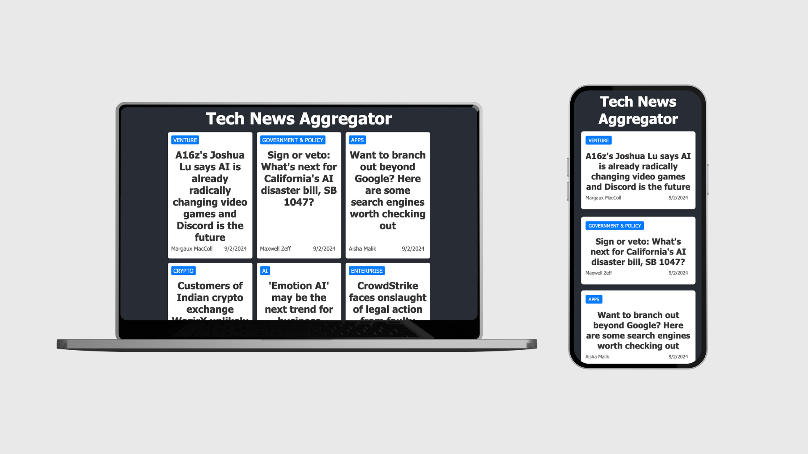

# Tech News Aggregator

**Tech News Aggregator** is a web application designed to scrape and display the latest news articles from TechCrunch and The Verge. The application uses the Firecrawl API to scrape data from these websites and the Anthropic API (Claude) to extract and structure this data. The scraped news items, including the category, title, author, and published date, are then presented in an attractive front-end interface built with React and styled using CSS.

[](https://vimeo.com/1005606709)
Click the image to watch the demo

## Project Intent

The main goal of this project is to:

- Demonstrate how to use web scraping tools like Firecrawl to gather data from websites.
- Extract and structure data from the scraped content using a language model API (Anthropic API).
- Provide a clean front-end interface to display the aggregated news articles.
- Offer a practical example of integrating multiple technologies (C#, React, APIs) to create a full-stack application.

## Features

- Scrapes the latest news articles from TechCrunch and The Verge.
- Displays the news articles in a structured format, including the news category, title, author, and published date.
- Provides a responsive design that works well on both desktop and mobile devices.

## Technologies Used

- **C# (.NET)**: Backend services for scraping and processing data.
- **TypeScript**: Front-end language.
- **React**: Front-end framework for building the user interface.
- **Firecrawl API**: For scraping web data from TechCrunch.
- **Anthropic API (Claude)**: For processing and structuring the scraped data.
- **CSS**: For styling the front-end components.

## Prerequisites

Before you begin, ensure you have the following installed on your machine:

- [.NET SDK](https://dotnet.microsoft.com/download) (6.0 or later)
- [Node.js](https://nodejs.org/en/download/) (16.0 or later)
- [npm](https://www.npmjs.com/get-npm) (usually comes with Node.js)

## Getting Started

Follow these instructions to set up and run the project locally.

### Backend Setup

1. Clone the repository
2. Navigate to the backend directory
3. Set up your API keys:
    - Open the NewsController.cs file located in the Controllers directory.
    - Replace the placeholder values with your actual Firecrawl API key and your Anthropic API key.
4. Restore dependencies, build and run the project:
    ```bash
    dotnet restore
    dotnet build
    dotnet run
    ```

### Frontend Setup

1. Navigate to the frontend directory
2. Install dependencies and run the project:
    ```bash
    npm install
    npm start
    ```

## Usage
View Latest News: Open your browser and go to http://localhost:3000 to view the latest news articles scraped from TechCrunch and The Verge

[Watch de demo video](https://vimeo.com/1005606709)